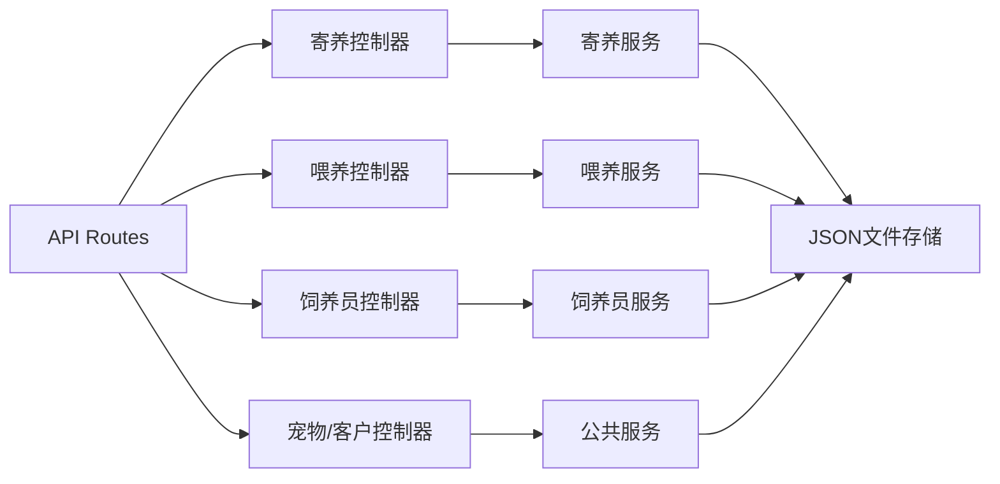
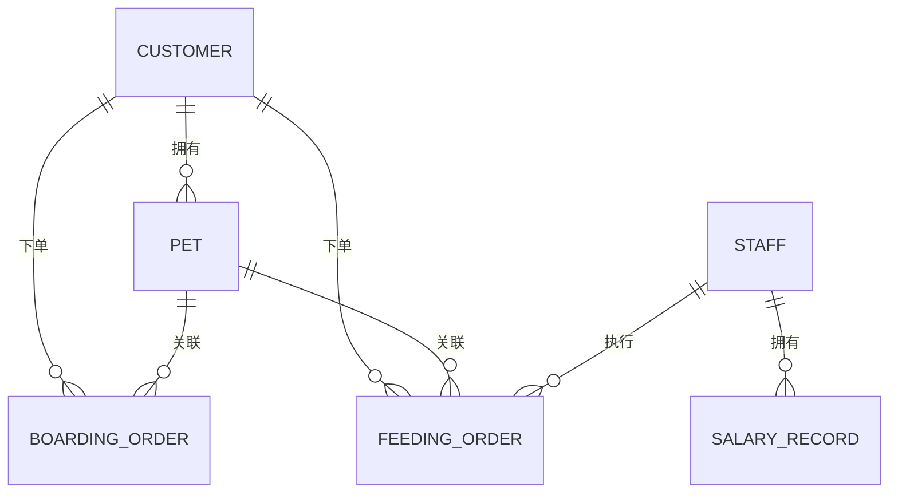

## 1. 架构设计

```mermaid
graph TD
    subgraph 前端["前端应用
    路由["React Router"]
    状态["Zustand 状态管理"]
    UI["TailwindCSS UI"]
    页面["页面组件"]
    组件["通用组件"]
    路由 --> 页面
    页面 --> 组件
    页面 --> 状态
    组件 --> UI
    状态 --> API["API Client"]
    end

    subgraph 后端["Express 后端"]
    控制器["Controllers"]
    服务["Services"]
    数据["Mock Data Store"]
    路由API["API Routes"]
    路由API --> 控制器 --> 服务 --> 数据
    end

    API -->|HTTP/JSON| 路由API
```

## 2. 技术说明
- **前端**：React@18 + TypeScript + TailwindCSS@3 + Vite
- **后端**：Express@4 + TypeScript
- **状态管理**：Zustand
- **路由**：React Router DOM@6
- **图标**：Lucide React
- **图表**：Recharts
- **数据存储**：内存 Mock 数据（文件持久化到 JSON）
- **初始化工具**：vite-init

## 3. 路由定义
| 路由路径 | 页面用途 |
|---------|---------|
| / | 登录页 |
| /dashboard | 仪表盘 |
| /boarding | 寄养订单列表 |
| /boarding/new | 新建寄养订单 |
| /boarding/pricing | 寄养计费规则 |
| /feeding | 上门喂养订单 |
| /feeding/schedule | 喂养日程调度 |
| /staff | 饲养员管理 |
| /staff/salary | 工资核算 |
| /pets | 宠物档案 |
| /customers | 客户管理 |
| /settings | 系统设置 |

## 4. API 定义

### 类型定义：
```typescript
// 寄养订单
interface BoardingOrder {
  id: string;
  customerId: string;
  petId: string;
  checkIn: string;
  checkOut: string;
  roomType: 'standard' | 'deluxe' | 'suite';
  services: string[];
  status: 'pending' | 'checked_in' | 'checked_out' | 'cancelled';
  totalAmount: number;
  createdAt: string;
}

// 上门喂养订单
interface FeedingOrder {
  id: string;
  customerId: string;
  petAddress: string;
  petId: string;
  scheduledDate: string;
  scheduledTime: string;
  duration: number;
  services: string[];
  staffId: string;
  status: 'pending' | 'assigned' | 'in_progress' | 'completed' | 'cancelled';
  amount: number;
}

// 饲养员
interface Staff {
  id: string;
  name: string;
  phone: string;
  skills: string[];
  baseSalary: number;
  performanceRate: number;
}

// 工资记录
interface SalaryRecord {
  id: string;
  staffId: string;
  month: string;
  baseSalary: number;
  performance: number;
  allowance: number;
  deduction: number;
  total: number;
  status: 'pending' | 'paid';
}

// 宠物
interface Pet {
  id: string;
  name: string;
  type: 'dog' | 'cat' | 'other';
  breed: string;
  customerId: string;
}

// 客户
interface Customer {
  id: string;
  name: string;
  phone: string;
  address: string;
}
```

## 5. 后端服务架构



## 6. 数据模型


